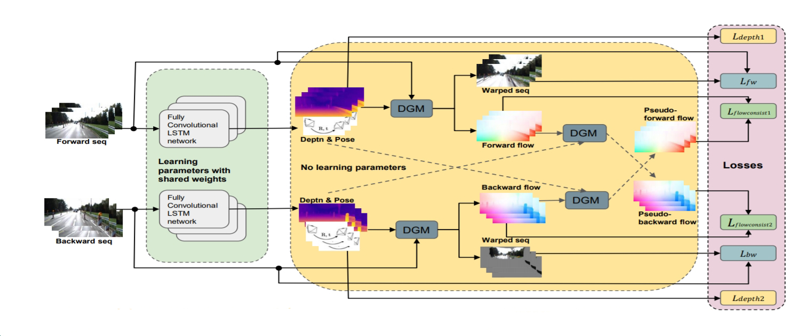

## Monocular Visual Odometry and Depth Estimation using RNN

Pytorch based implementation of the paper: https://arxiv.org/abs/1904.07087
By: Rui Wang, Stephen M. Pizer, Jan-Michael Frahm


# Architecture
<p align='center'>

</p>


## Note:
```
Repo under active development. Will be updated very soon
```

## Code Developed on:
```
 Python 3.7
 PyTorch 1.4
 CUDA 10.2
 Ubuntu 18.04 
```

## Data Pre-Processing:
```
 Download the Kitti raw and depth data and use the scripts in the data folder 
```

## TODO

```
 [ ] Fix broken code and clean it up
 [ ] Add validation code
 [ ] Train the model
 [ ] Upload results
```

## Cite
```
@inproceedings{wang2019recurrent,
  title={Recurrent Neural Network for (Un-) supervised Learning of Monocular Video Visual Odometry and Depth},
  author={Wang, Rui and Pizer, Stephen M and Frahm, Jan-Michael},
  booktitle={Proceedings of the IEEE Conference on Computer Vision and Pattern Recognition},
  pages={5555--5564},
  year={2019}
}
```
